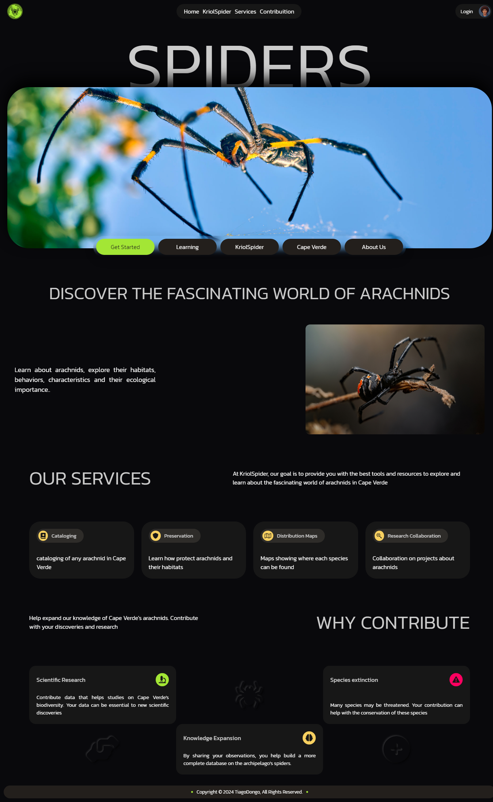

# KriolSpider

---

This is a project dedicated to cataloging and providing information about arachnids found in Cape Verde.  
Explore species, their habitats, behaviors, and ecological significance

## Features

- Detailed arachnid species catalog
- Awareness and conservation initiatives
- Research collaboration and contribution

## Screenshots

